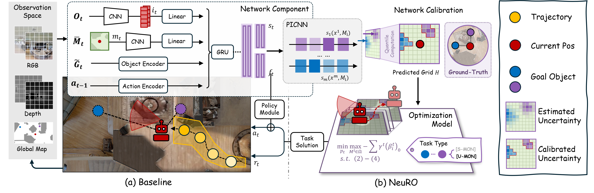
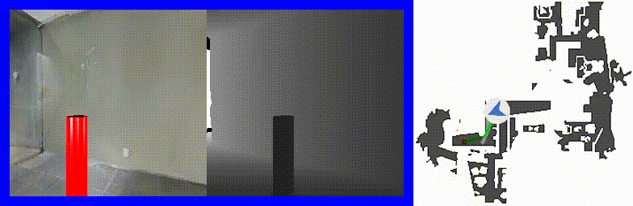
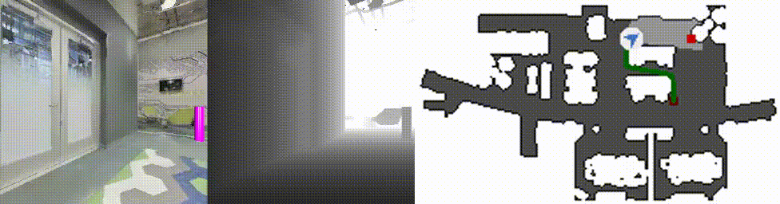

<div align=left>
    
</div>

<h1 style="text-align: center;">Seeing through Uncertainty: Robust Task-Oriented Optimization in Visual Navigation</h1>

[](https://arxiv.org/abs/2510.00441)
[](https://github.com/your-repo/NeuRO)
[](https://www.python.org/downloads/release/python-380/)
[](https://github.com/facebookresearch/habitat-lab)

## 📝 Abstract

> Visual navigation is a fundamental problem in embodied AI, yet practical deployments demand long-horizon planning capabilities to address multi-objective tasks. A major bottleneck is data scarcity: policies learned from limited data often overfit and fail to generalize OOD. Existing neural network-based agents typically increase architectural complexity that paradoxically become counterproductive in the small-sample regime. This paper introduce NeuRO, a integrated learning-to-optimize framework that tightly couples perception networks with downstream task-level robust optimization. Specifically, NeuRO addresses core difficulties in this integration: (i) it transforms noisy visual predictions under data scarcity into convex uncertainty sets using Partially Input Convex Neural Networks (PICNNs) with conformal calibration, which directly parameterize the optimization constraints; and (ii) it reformulates planning under partial observability as a robust optimization problem, enabling uncertainty-aware policies that transfer across environments. Extensive experiments on both unordered and sequential multi-object navigation tasks demonstrate that NeuRO establishes SoTA performance, particularly in generalization to unseen environments. Our work thus presents a significant advancement for developing robust, generalizable autonomous agents.



## 🎬 A demo of NeuRO in action!

<div align="center">
    
    
</div>


## ✨ Key Features

- **Robust Optimization Framework**: NeuRO integrates perception networks with downstream task-level robust optimization
- **Uncertainty Quantification**: Uses Partially Input Convex Neural Networks (PICNNs) with conformal calibration to transform noisy visual predictions into convex uncertainty sets
- **Transfer Learning**: Enables uncertainty-aware policies that transfer across environments
- **Multi-Object Navigation**: Supports both unordered and sequential multi-object navigation tasks
- **State-of-the-Art Performance**: Establishes SoTA performance, particularly in generalization to unseen environments

## 🛠️ Installation

This code is tested on Python 3.8.20, PyTorch 2.4.1+cu121 and CUDA 12.1.

Install PyTorch from https://pytorch.org/ according to your machine configuration. For CUDA 12.1 support:

```bash
pip install torch==2.4.1+cu121 torchvision==0.19.1+cu121 torchaudio==2.4.1+cu121 --index-url https://download.pytorch.org/whl/cu121
```

This code uses [habitat-sim](https://github.com/facebookresearch/habitat-sim) and [habitat-lab](https://github.com/facebookresearch/habitat-lab). Install them by running the following commands:

#### Installing habitat-sim:

```bash
git clone https://github.com/facebookresearch/habitat-sim.git
cd habitat-sim 
git checkout ae6ba1cdc772f7a5dedd31cbf9a5b77f6de3ff0f
pip install -r requirements.txt; 
python setup.py install --headless # (for headless machines with GPU)
python setup.py install # (for machines with display attached)
```

#### Installing habitat-lab:
```bash
git clone --branch stable https://github.com/facebookresearch/habitat-lab.git
cd habitat-lab
git checkout 676e593b953e2f0530f307bc17b6de66cff2e867
pip install -e .
```


## 🚀 Quick Start

1. Clone the repository and install the requirements:

```bash
git clone https://github.com/your-repo/NeuRO.git
cd NeuRO
pip install -r requirements.txt
```

**Note**: The requirements.txt includes specific versions tested with this codebase:
- tqdm==4.45.0
- torch_scatter==2.0.3
- matplotlib==3.2.1
- opencv_python==3.4.4.19
- einops==0.2.0
- cvxpy, cvxpylayers (for optimization)

2. Download data and checkpoints

Thanks to the excellent work [MultiON](https://shivanshpatel35.github.io/multi-ON/), we adopted the instruction sets from their work. You will need to run `download_multion_data.sh` from their root directory.


3. Download Matterport3D scenes

The Matterport scene dataset and multiON dataset should be placed in `data` folder under the root directory in the following format:

```
NeuRO/
  data/
    scene_datasets/
      mp3d/
        1LXtFkjw3qL/
          1LXtFkjw3qL.glb
          1LXtFkjw3qL.navmesh
          ...
    datasets/
      multinav/
        3_ON/
          train/
            ...
          val/
            val.json.gz
        2_ON
          ...
        1_ON
          ...
```				

Download Matterport3D data for Habitat by following the instructions mentioned [here](https://github.com/facebookresearch/habitat-api#data).

## 💻 Usage

### Evaluation

Evaluation will run on the `2_ON` test set by default. To evaluate a pretrained agent, run this from the root folder:

```bash
python habitat_baselines/run.py --exp-config habitat_baselines/config/multinav/ppo_multinav.yaml --agent-type oracle-ego --run-type eval
``` 

### Training

For training the agent, run this from the root directory: 

```bash
python habitat_baselines/run.py --exp-config habitat_baselines/config/multinav/ppo_multinav.yaml --agent-type oracle-ego --run-type train
```

## 📚 Citation

If you find this work useful, please cite our paper:

```BibTeX
@article{pan2025seeing,
  title={Seeing through Uncertainty: Robust Task-Oriented Optimization in Visual Navigation},
  author={Pan, Yiyuan and Xu, Yunzhe and Liu, Zhe and Wang, Hesheng},
  journal={arXiv preprint arXiv:2510.00441},
  year={2025}
}
```

## 🙏 Acknowledgments

This repository is built upon [Habitat Lab](https://github.com/facebookresearch/habitat-lab) and [MultiON](https://shivanshpatel35.github.io/multi-ON/). We thank the authors for their excellent work and for making their code publicly available.

## 📄 License

This project is licensed under the MIT License - see the [LICENSE](LICENSE) file for details.

## 📋 TODO

### ✅ Completed
- ~~Release complete architecture code on original MultiON tasks~~ *(10/13/2025)*

### 🔄 In Progress
- Release optimal weights

- Others

## 📧 Contact

For questions and issues, please open an issue on GitHub or contact [Yiyuan Pan](mailto:your-email@example.com).
